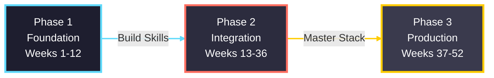
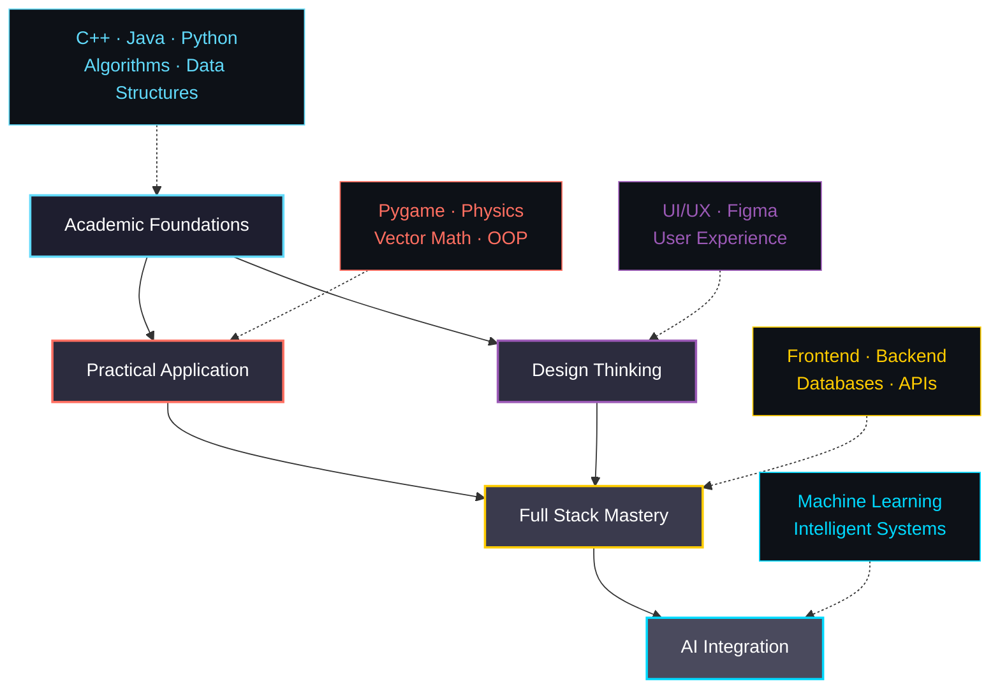

# 👋 Hello! I'm Vee!

  <b>Welcome to my development space. 🚀</b> 
  Computer Science student mastering <b>Full Stack Development</b> through systematic learning. 
  Combining <b>technical depth</b> with <b>design thinking</b> to build scalable, intuitive digital experiences.

<!-- Tech Stack Badges -->

  
  
  
   
  
  
  
   
  
  
  

<!-- Quick Links -->

  <a href="#project52---2026-challenge">PROJECT52</a> •
  <a href="#portfolio">Portfolio</a> •
  <a href="#skills--focus">Skills</a> •
  <a href="#github-activity">Stats</a> •
  <a href="#connect">Connect</a>

---

## 📑 Table of Contents

- [PROJECT52 - 2026 Challenge](#project52---2026-challenge)
- [Portfolio](#portfolio)
- [Skills & Focus](#skills--focus)
- [GitHub Activity](#github-activity)
- [2026 Goals](#2026-goals)
- [Connect](#connect)

---

## PROJECT52 - 2026 Challenge

### One Project. Every Week. For 52 Weeks.

**[Complete Roadmap & Details →](https://github.com/pak-pow/PROJECT52)**

> **Mission:** Master Full Stack Development through 52 progressive projects—from Python fundamentals to production-ready applications.

### Three-Phase Journey

<table align="center">
<tr>
<td align="center" width="33%">

### Phase 1: Foundation
**Weeks 1-12 | 12 Projects**

[Repository →](https://github.com/pak-pow/PROJECT52-PHASE1)

Master individual technologies:
- HTML, CSS, JavaScript
- Python fundamentals
- Basic algorithms
- UI components

**Status:** Not Started

</td>
<td align="center" width="33%">

### Phase 2: Integration
**Weeks 13-36 | 24 Projects**

[Repository →](https://github.com/pak-pow/PROJECT52-PHASE2)

Connect the stack:
- REST APIs
- Databases (SQL)
- Full-stack apps
- Real-time features

**Status:** Not Started

</td>
<td align="center" width="33%">

### Phase 3: Production
**Weeks 37-52 | 16 Projects**

[Repository →](https://github.com/pak-pow/PROJECT52-PHASE3)

Deploy and scale:
- Docker & CI/CD
- Cloud deployment
- Testing & security
- SaaS product

**Status:** Not Started

</td>
</tr>
</table>

### What I'll Build

| Category | Count | Examples |
|:---------|:-----:|:---------|
| **Frontend** | 16 | Portfolio sites, dashboards, PWAs |
| **Backend** | 14 | REST APIs, authentication, file systems |
| **Full Stack** | 17 | E-commerce, chat apps, booking systems |
| **DevOps** | 5 | Docker containers, automated testing, CI/CD |

**[View Detailed Week-by-Week Plan →](https://github.com/pak-pow/PROJECT52)**

---

## Portfolio

Current projects showcasing design and development capabilities.

| Project | Role | Description | Stack | Status |
| :------ | :--- | :---------- | :---- | :----: |
| **[KlimaTech](https://github.com/pak-pow/KlimaTech)** | UI/UX Designer | Hackathon project centered on climate action. Delivered a complete UX workflow with high-fidelity prototyping, accessibility-driven UI, and clear user flows. | `Figma` | ✅ |
| **[ConFisense](https://github.com/pak-pow/ConFisense)** | UI/UX Designer | Financial analytics dashboard with modular and scalable interface systems, reusable components, and design–development alignment. | `Figma` `Design Systems` | ✅ |
| **[pygame_projects](https://github.com/pak-pow/pygame_projects)** | Developer | A structured, multi-stage roadmap exploring game development foundations with custom 3D raycasting engine, vector math & physics simulation. | `Python` `Pygame` | 🟢 |
| **[store-projects](https://github.com/pak-pow/store-projects)** | Developer | Practical business tools designed for retail environments including inventory systems, Point-of-Sale applications, and SQL-based data handling. | `Python` `SQL` | 🟡 |
| **[small-and-simple](https://github.com/pak-pow/small-and-simple-projects)** | Developer | A living archive of problem-solving exercises and utility scripts for fundamental CS reinforcement and algorithm experimentation. | `Python` | 🟢 |

---

## Skills & Focus

My work is guided by the idea of uniting **theoretical knowledge** with **practical engineering**.

### Learning Progression Map

<table>
<tr>
<td width="33%" align="center">

**Systems & Logic**  
*Current Foundation*

Built on a strong academic background in C++, Java, and Python emphasizing:

- Algorithmic Thinking
- Efficient Memory Use
- System-Level Logic
- Data Structures

</td>
<td width="33%" align="center">

**Applied Mathematics**  
*Active Development*

Game development & simulations as my sandbox for applied mathematics:

- Linear Algebra & Vectors
- Physics Simulation
- Raycasting Architecture
- Rendering Optimization

</td>
<td width="33%" align="center">

**Full Stack Engineering**  
*2026 Focus*

Evolving toward production-grade full-stack development:

- Frontend Frameworks
- Backend Architecture
- Database Design
- ML Integration

</td>
</tr>
</table>

---

## GitHub Activity

<table>
<tr>
<td width="50%">

</td>
<td width="50%">

</td>
</tr>
</table>

 

 

---

## 2026 Goals

| Objective | Target | Progress |
|:----------|:------:|:--------:|
| Complete PROJECT52 | 52/52 Projects | 🔴 2/52 |
| Deploy Live Projects | 15+ Apps | 🔴 0/15 |
| Open Source Contributions | 10+ PRs | 🔴 0/10 |
| Master Full Stack Development | Complete | 🟡 In Progress |

### Weekly Commitment
- **4-10 hours** dedicated development time per week
- **Document learnings** in detailed READMEs
- **Deploy projects** publicly when possible
- **Share progress** and insights with community

---

## Connect

I'm always interested in discussing:
- Full-stack development & architecture
- Game development & mathematical simulations
- UI/UX design & user experience
- AI/ML applications & integration
- Career growth & learning strategies

**Open to:** Collaboration • Mentorship • Project Partnerships • Technical Discussions

  

**📍 Location:** Philippines (UTC+8)  
**🎓 Status:** Computer Science Student  
**💼 Availability:** Open to opportunities starting 2026

 

---

### 💭 Philosophy

*"The expert in anything was once a beginner who refused to give up."*

**Right Now:** Relearning Python fundamentals & mathematics  
**January 2026:** Launching PROJECT52 challenge  
**End of 2026:** Full Stack Developer ready for production work

⭐ **Star my repos** if you find them useful! | 🔔 **Follow** to track my PROJECT52 journey

