# 👋 Hello! I'm Vee!

  <b>Welcome to my development space. 🚀</b> 
  I’m a Computer Science student with a strong foundation in system-level languages like <b>C++</b>, <b>Java</b>, and <b>Python</b> now expanding deeper into <b>Game Development</b>, <b>Mathematics</b>, and <b>Emerging AI Systems</b>. I combine analytical thinking with design-oriented problem solving to build clean, scalable, and intuitive digital experiences.

<!-- Tech Stack -->

  
  
  
  
   
  
  
  
   
  
  

---

## 🎨 Design & Development Portfolio

A curated showcase of my ongoing technical and design work.

| Project | Role | Description | Stack |
| :--- | :--- | :--- | :--- |
| **[KlimaTech](https://github.com/pak-pow/KlimaTech)** | **UI/UX Designer** | Hackathon project centered on climate action. Delivered a complete UX workflow.<ul><li>High-fidelity prototyping</li><li>Accessibility-driven UI</li><li>Clear, intuitive user flows</li></ul> | `Figma` |
| **[ConFisense](https://github.com/pak-pow/ConFisense)** | **UI/UX Designer** | Financial analytics dashboard with modular and scalable interface systems.<ul><li>Reusable components</li><li>Data visualization simplification</li><li>Design–development alignment</li></ul> | `Figma` `Design Systems` |
| **[pygame_projects](https://github.com/pak-pow/pygame_projects)** | **Developer** | A structured, multi-stage roadmap exploring game development foundations.<ul><li>Custom 3D raycasting engine</li><li>Vector math & physics simulation</li><li>Deep OOP practice</li></ul> | `Python` `Pygame` |
| **[store-projects](https://github.com/pak-pow/store-projects)** | **Developer** | Practical business tools designed for retail environments.<ul><li>Inventory systems</li><li>Point-of-Sale applications</li><li>SQL-based data handling</li></ul> | `Python` `SQL` |
| **[small-and-simple](https://github.com/pak-pow/small-and-simple-projects)** | **Developer** | A living archive of problem-solving exercises and utility scripts.<ul><li>Fundamental CS reinforcement</li><li>Algorithm experimentation</li><li>Lightweight automation tools</li></ul> | `Python` |

---

## 🔭 Vision & Technical Focus

My work is guided by the idea of uniting **theoretical knowledge** with **practical engineering**.

### 📊 Skills Progression Diagram

```mermaid
%% Premium dark-mode horizontal layout
graph LR
    %% Nodes with emojis, gradients (simulated), and bright text
    A[🏛️ Academic Foundations<br/>C++ · Java · Python · Algorithms] -->|Apply Logic| B[🎮 Practical Simulation<br/>Pygame · Physics · Vector Math · OOP]
    B -->|Advance Skills| C[🚀 Future Architecture<br/>Machine Learning · Full Stack Development]

    %% Node styles
    style A fill:#1e1e2f,stroke:#61dafb,stroke-width:2px,color:#ffffff
    style B fill:#2c2c3e,stroke:#ff6f61,stroke-width:2px,color:#ffffff
    style C fill:#3a3a4d,stroke:#ffcc00,stroke-width:2px,color:#ffffff

    %% Edge styles
    linkStyle 0 stroke:#61dafb,stroke-width:2px,stroke-dasharray: 5 5
    linkStyle 1 stroke:#ffcc00,stroke-width:2px,stroke-dasharray: 2 2
```

### 🔄 Systems & Logic (Foundations)

Built on a strong academic background in **C++**, **Java**, and **Python** emphasizing _algorithmic thinking_, _efficient memory use_, and _system-level logic_.

### 🎮 Computational Geometry (Current Focus)

Game development serves as my sandbox for applied mathematics:

* Linear Algebra & Vectors
* Particle & Physics Simulation
* Engine/Raycasting Architecture
* Rendering Logic and Optimization

### 🤖 Intelligent Systems (Future Path)

Evolving toward **full-stack development** integrated with **ML-powered systems** and intelligent interactive applications.

---

## 📊 GitHub Statistics

 

---

## 🤝 Let's Connect

I enjoy discussing game logic, UI/UX design, system architecture, and pathways into machine learning.
Feel free to reach out!

